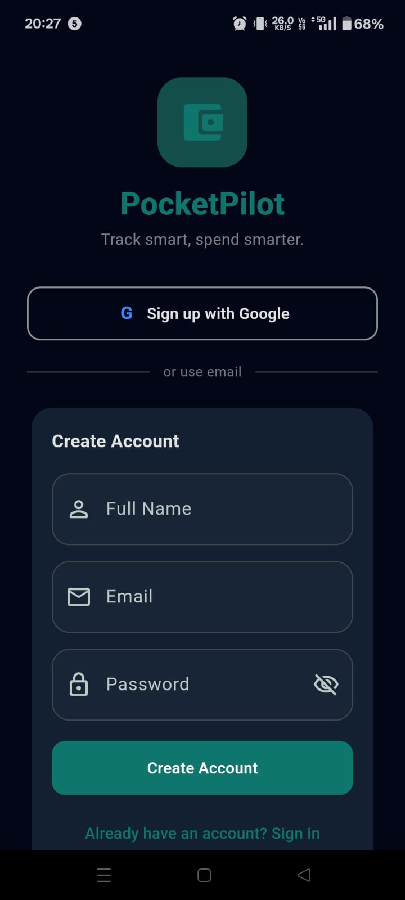
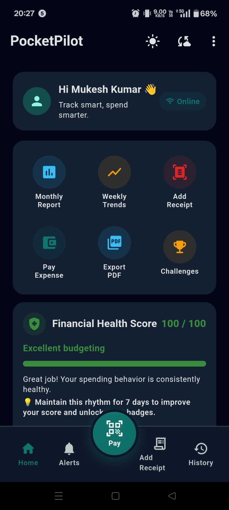
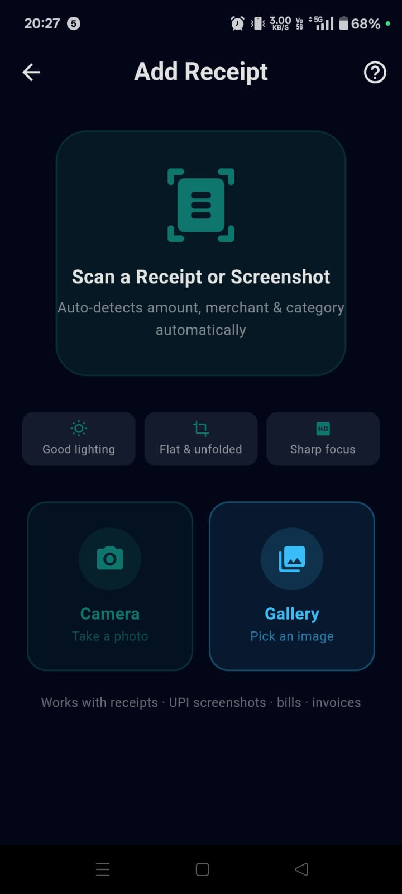
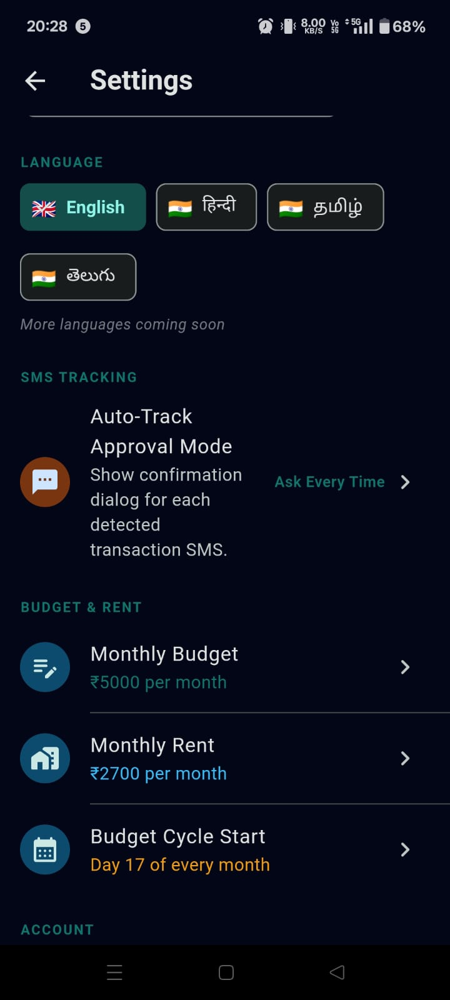
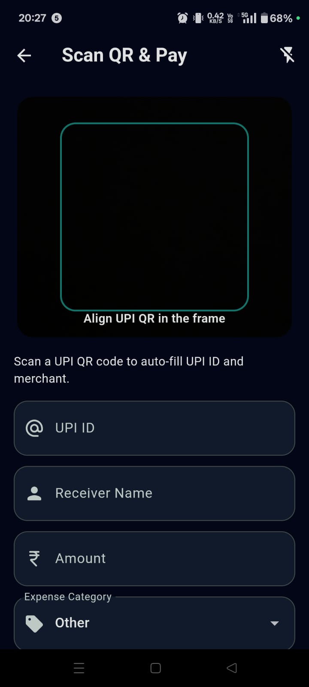

# PocketPilot – Smart Budget Tracker for Students


**Hackathon:** TRAE Re{Vibe}
**Team Name:** Quantum Coders

PocketPilot helps students track spending, predict overspending, and manage their monthly budget intelligently.

---

## Problem Statement

Students often face a practical money-management problem:

- They run out of money before the end of the month.
- They usually do not track daily spending consistently.
- Many existing finance apps are overloaded with features and too complex for student use.

Why this matters:

- Financial stress directly affects academic focus, productivity, and well-being.
- Small daily expenses become large monthly leaks when not tracked.
- Students need a lightweight, smart, and actionable budgeting assistant—not a heavy accounting tool.

---

## Solution

PocketPilot is designed as a student-first budgeting app that combines simplicity with smart insights.

It solves the problem through:

- **Daily spending limit** based on remaining budget and days left in the month
- **Expense tracking** with categories and quick add flow
- **AI overspending prediction** using current spending pace
- **Spending analytics** via visual charts and monthly reports
- **Receipt scanner (OCR)** to auto-fill expense details
- **Smart alerts** when spending patterns become risky

---

## Features

### Core Features

- Monthly budget tracking
- Rent deduction from total monthly budget
- Expense categories
- Daily spending limit
- Expense history

### Advanced Features

- Spending analytics charts
- Monthly report
- AI overspending prediction
- Smart alerts
- Receipt scanner (OCR)
- Cloud sync
- Google login

---

## App Screens

- Login Screen
- Register Screen
- Home Dashboard
- Add Expense Screen
- Monthly Report Screen
- Weekly Trends Screen

---

## Tech Stack

### Frontend

- Flutter

### Backend / Cloud

- Firebase Authentication
- Cloud Firestore
- (Optional API sync layer / extensible backend support)

### Database

- SQLite (local storage via `sqflite`)

### Libraries

- `fl_chart`
- `google_mlkit_text_recognition`
- `firebase_auth`
- `cloud_firestore`
- `google_sign_in`
- `provider`

---

## Project Structure

```text
lib/
  models/      # Data models (Expense, User, etc.)
  services/    # Business logic (auth, DB, sync, prediction, reports)
  screens/     # UI screens (login, home, add expense, reports)
  widgets/     # Reusable UI components (cards, charts, etc.)
  utils/       # Helpers (OCR parsing, demo seed helper, utilities)
```

Folder overview:

- `models/`: Strongly typed app entities and mapping helpers.
- `services/`: App logic for persistence, authentication, notifications, analytics, and sync.
- `screens/`: Route-level UI pages used in the app flow.
- `widgets/`: Reusable presentation components to keep screens clean.
- `utils/`: Utility helpers for OCR parsing, demo seed data, and supportive functions.

---

## Installation Guide

### 1) Install Flutter

- Follow the official Flutter setup guide for your OS.
- Verify installation:

```bash
flutter --version
```

### 2) Clone Repository

```bash
git clone https://github.com/TheMukeshDev/PocketPilot.git
cd PocketPilot
```

### 3) Install Dependencies

```bash
flutter pub get
```

### 4) Configure Firebase

- Add Android config file: `android/app/google-services.json`
- Add iOS config file: `ios/Runner/GoogleService-Info.plist`
- Enable Email/Password and Google Sign-In in Firebase Authentication.

### 5) Run Application

```bash
flutter run
```

---

## Configuration

### Environment Variables (`.env`)

- Copy `.env.example` to `.env`.
- Fill all values before running the app.
- `.env` is ignored by git and should never be committed.

Required keys:

- `ENABLE_DEMO_LOGIN`
- `DEMO_EMAIL`
- `DEMO_PASSWORD`
- `ENABLE_SMS_AUTOTRACK`
- `GOOGLE_WEB_CLIENT_ID`
- `GEMINI_API_KEY` (optional, required only for AI receipt extraction)
- `FIREBASE_API_KEY`
- `FIREBASE_APP_ID`
- `FIREBASE_MESSAGING_SENDER_ID`
- `FIREBASE_PROJECT_ID`
- `FIREBASE_STORAGE_BUCKET`

### Firebase

- Create a Firebase project.
- Register Android/iOS apps.
- Download and place:
  - `android/app/google-services.json`
  - `ios/Runner/GoogleService-Info.plist`

### Google Sign-In

- Enable Google provider in Firebase Authentication.
- Configure SHA-1 and SHA-256 for Android in Firebase console.
- Re-download `google-services.json` after SHA setup updates.

### Database

- Local persistence uses SQLite (`sqflite`).
- Database initializes on app start and stores expenses for offline usage.

---

## Usage

1. Login (Email/Password or Google).
2. Set your monthly budget (and rent if applicable).
3. Add expenses manually or via receipt scan.
4. View spending chart and monthly report.
5. Check AI overspending prediction and smart alerts.

---

## Demo Flow (Hackathon)

**Suggested 90-second flow:**

1. Login with demo/test account.
2. Add an expense quickly.
3. Use **Scan Receipt** to auto-fill merchant + amount.
4. Save and show updated chart on Home.
5. Open Monthly Report for category breakdown and top expenses.
6. Show AI prediction card with overspend warning.
7. Trigger/show smart alert behavior.
8. (Optional) Tap Sync to demonstrate cloud sync.

Flow summary:

`Login → Add Expense → Scan Receipt → View Chart → AI Prediction → Smart Alert`

---

## Future Improvements

- Voice expense entry
- Financial health score
- Expense sharing with friends/groups
- Dark mode customization enhancements
- Bank SMS auto-detection

---

## Contributing

Contributions are welcome.

1. Fork the repository.
2. Create a feature branch.
3. Commit your changes with clear messages.
4. Run checks (`flutter analyze`, tests).
5. Open a pull request with a concise description.

---

## License

MIT License

---

## Author

**Mukesh**

- GitHub: https://github.com/TheMukeshDev

---

## Demo Screenshots







## Quick Commands

```bash
flutter pub get
flutter analyze
flutter test
flutter run
```